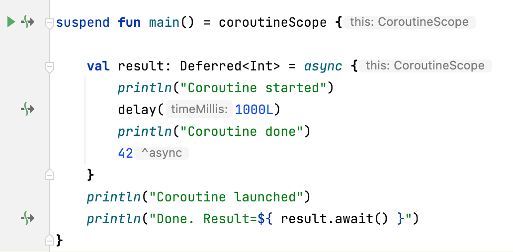

# What is a coroutine?

```kotlin
  launch {
      println("Coroutine started")
      delay(1000L)
      println("Coroutine done")
  }
```

<!--
Korutiner har sin opprinnelse helt tilbake til 60 tallet, men ble først popularisert med goroutines i Golang, og nå i Kotlin

Det grunleggende prinsippet med Korutiner er at en funksjon kan stoppes (suspend) for å så fortsette senere (resume). 

I motsetning til tråder, er ikke korutiner noe som styres av operativsystemet.
Hvordan korutiner startes og stoppes og hvilke tråder de kjører på styres
av korutine-biblioteket i Kotlin
-->

---

# Coroutines - Motivation

- Avoid blocking main thread
- Do long computation in the background
- Threads are resource hungry
- Concurrency with Threads is difficult. Deadlocks & memory leaks
- Do tasks in parallel

<!--
Hvorfor trenger vi korutiner?

Hvis vi har en interaktiv applikasjon, det være seg en mobil app, javascript på
en nettside, eller en gui applikasjon, så er det typisk en tråd som brukes til å tegne opp og oppdatere det grafiske grensesnittet. Hvis vi trenger å hente 
en nettverksressurs, eller gjøre intensive beregninger, så er det viktig å
ikke gjøre det fra denne tråden. Gjør vi det vil gui fryse så lenge vi blokkerer denne tråden.

Dette kan vi løse ved å fyre opp en ny tråd for å gjøre arbeidet. Men kode med
flere tråder blir fort kompleks, og det er fort gjort å ende opp med deadlocks eller minne.
Tråder er også relativt ressurskrevende, og det tar tid å bytte mellom dem.

Korutiner er lettvekts og 
raske å bytte mellom. bytting av hvilke korutiner som kjører og blir suspended, og kan gjenbruke minnet til en suspended korutine.
-->

---

# launch
<div class="columns">
<div>

```kotlin
val job: Job = launch {
    println("Coroutine started")
    delay(1000L)
    println("Coroutine done")
}
println("Coroutine launched")
job.join()

// Coroutine launched
// Coroutine started
// Coroutine done
```

</div>
<div>

- Builds coroutine and starts it immediately
- extension function on CoroutineScope interface
- returns a `Job`
  can cancel or wait for completion
- does not return a value from the lambda (other than the job)
- waits for coroutines inside to finish (suspends but does not block)

</div>
</div>

<!--
Hvordan starter vi en korutine?
launch er en coroutine builder som lager en korutine, som startes umiddelbart 

launch starter korutinen asynkront, den returnerer umiddelbart, og venter ikke på at korutinen skal bli ferdig,

men den returnerer en instans av Job som vi kan bruke til å vente på den. Job kan også brukes til å avbryte korutinen (cancell). Når vi venter på at den blir ferdig med join, blokkerer vi ikke tråden vi kjører på som med join på en thread, men suspender til korutinen er ferdig.
Om vi starter flere korutiner inni denne korutinen, vil den ikke fullføre før
de er ferdige.
[Forklar koden og hva output blir]
-->

---

# async / await

<div class="columns">
<div>

```kotlin
val result: Deferred<Int> = async {
    delay(1000L)
    42
}
val intValue = result.await()
println("The answer is $intValue")

// The answer is 42
```

</div>
<div>

- Build and start coroutine (like launch)
- extension on CoroutineScope interface
- Returns Deferred<T> which is subclass of Job
- Can cancel or join like with Job
- Can also `await`, which produces a value when completed
- `await` will suspend until value is ready

</div>
</div>

<!--
Starter en ny korutine som launch, med returnerer en Deferred som er en subklasse av Job. Vi kan derfor kalle join for å vente som ved launch, men vi
kan også bruke await som venter og gir returverdien fra korutinen. Dvs siste
expression i lambdaen. Som ved join vil await ikke blokkere, men suspende
[Forklar koden]
-->

---

# async / await (continued)

<div class="columns">
<div>

```kotlin
val deferreds: List<Deferred<Int>> = (1..100).map {
    async {
        delay(1000)
        it
    }
}
val list: List<Int> = deferreds.awaitAll()
println("Sum = ${list.sum()}")

// Sum = 5050
```

</div>
<div>


- If you need to await on multiple `Deferred` there is `awaitAll(...)`

</div>
</div>

<!--
Ofte vil man starte mange korutiner asynkront, og så vente på at alle skal fullføre. Da kan man bruke awaitAll som er en extension på Liste av Deferred. 
den suspender til alle er ferdige, og så produserer den en liste av verdiene til
alle korutinene.
-->

---

# Structured concurrency

<div class="columns">
<div>

```kotlin
    val parent = async {
  
        var child = async {
            delay(2000L)
        }
  
    }
```

</div>
<div>

- child coroutine inherits properties from parent
- cancellation of parent propagates to children
- errors in children propagate to parents
- ensures proper cleanup of resources

</div>
</div>

<!--
  Med structured concurrency forsøker man å strukturere bruken av korutiner
  på en måte oversiktlig og trygg måte. Nøsting av uttrykk for korutiner skaper ett 
  hierarki som samsvarer med organiseringen av koden, og som sørger for at feil
  propagerer oppover om de ikke håndteres.

StructuredConcurency betyr at korutiner arver context egenskaper (som Dispatcher) fra korutinen den startes i (parent). 
Om forelder korutinen blir cancelled, vil
alle child korutiner også bli canceled. Dette gir en naturlig måte å organisere korutiner på. 
-->

---

# CoroutineScope & CoroutineContext

- `CoroutineScope` Holds a `CoroutineContext`
- Coroutine builders as extensions on `CoroutineScope`
  - `launch`
  - `async`
- Coroutine builders inherit context from `CoroutineScope`
- `CoroutineContext` is a set of properties
- `coroutineScope { }` creates a new `CoroutineScope`
  - used in suspending function gives access to calling scope
  
<!--
En CoroutineScope har en CoroutineContext som har contexten som bestemmer hvordan korutinen kjører. 
CoroutineContext inneholder bla.a 
En dispatcher som avgjør hvordan tråder allokeres og er `Job` objekt som kan brukes til å sjekke om korutinen kjører, og til å cancellere den.
Innebygde dispatchere `Dispatcher.Default|Main|IO|Unconfined`  Man kan også sett opp sin egen dispatcher.

Context og dermed tråd kan endres underveis i en korutine med `withContext`
-->

---

# Suspend Functions

<div class="columns">
<div>

```kotlin
suspend fun doSomething(): String = coroutineScope {
  delay(100L)

  val result = async {
    delay(100L)
    "done"
  }
  "I am ${result.await()}"
}

// I am done
```

</div>
<div>

- all functions that can suspend are marked with the `suspend` keyword
- suspending code can not be called from a non-suspending code
- but non-suspending code can be called from suspending code
- a suspend function doesn't provide a CoroutineScope
  - (we can use `coroutineScope {}` for that)

<!--
suspend er et nøkkelord i kotlin. Det markerer at funksjonen kan suspende og resume. 

Funksjoner som `runBlocking` og 
`coroutineScope {}` kan benyttes i en suspend funksjon for å få tilgang til 
coroutine scopet som funksjonen blir kallet fra kan man bruke couroutineScope
-->

</div>
</div>

---

# Suspend functions (continued)

<div class="columns">
<div>

```kotlin
public fun <T> CoroutineScope.async(
    context: CoroutineContext = EmptyCoroutineContext,
    start: CoroutineStart = CoroutineStart.DEFAULT,
    block: suspend CoroutineScope.() -> T
): Deferred<T> 
```

</div>
<div>

- `suspend` keyword in function signature
- lambda body is also `suspend`
- `this` is bound to a CoroutineScope in the lambda body

</div>
</div>

<!--
block er en lambda med en CoroutineScope receiver, som gjør at this er bundet til 
et CoroutineScope når lambdaen vi angir kjører. på samme måte som for en funksjon definert
med suspend fun makrkerer vi her at block er suspending, og derfor kan kalle andre suspend
funksjoner.
-->

---

# Suspend points



<!--
suspend og resume kan kun skje på suspend points. Intellij viser hvor i margen.
kall til coroutine biblioteket er typisk suspend points. også tredjeparts bibliotek som
støtter korutiner. Om man f.eks gjør en http request med en http klient som er beregnet
for bruke med korutiner, vil den suspende når http requesten gjøres, og resumes når responsen
kommer tilbake.
-->

---

# runBlocking

<div class="columns">
<div>

```kotlin
val s = runBlocking {
    delay(1000L)
    "world!"
}
println("Hello, $s")

// Hello, world!
```

</div>
<div>

- can be called from "normal" code
- not usually used outside of tests or main function
- waits for all contained coroutines to finish
- blocks the thread!

</div>
</div>

<!--
  runBlocking starter en ny korutine, men ikke asynkront som launch og await.
  den blokkerer tråden (ikke suspend) til alle korutiner er ferdige.
  Den er en bro mellom "vanlig" kode og korutiner (suspend), 
  Siden runBlocking skal kunne kalles fra normal kode kan den ikke suspende selv,
  men må blokkere tråden den kjører i til corutinene er ferdig. Returnerer siste verdi fra lambdaen direkte (ikke wrappet i deferred som async)
-->

---

# coroutineScope  

```kotlin
suspend fun downloadResource(url: URL): Resource = coroutineScope {
    // Using a suspending client
    httpClient.get(url)
}

suspend fun downloadResource(url: URL): Resource = withContext(Dispatchers.IO) {
    // Using a blocking client
    async { httpClient.get(url) }.await()
}
```

<!--

Gir tilgang til coroutinescope funksjonen kalles fra, og dermed også context
withContext gjør det samme, men lar deg tilpasse contexten. f,eks ved å endre Dispatcher

-->

---

# Combining contexts

```kotlin
        val c1 = currentCoroutineContext() + CoroutineName("c1") + Dispatchers.IO

        val c2 = c1 + Job() + CoroutineName("c2")
        
        assertEquals(c1[CoroutineDispatcher], c2[CoroutineDispatcher])
```

<!--

-->

---

# Coroutine Builders

- **launch**  
extension on `CoroutineScope`
asynchronous
returns Job but does not return value from body
- **async**  
extension on `CoroutineScope`
asynchronous
returns `Deferred` with return value from body
- **runBlocking**  
normal function
synchronous, blocks thread
returns value from body directly

<!-- 
alle kan kalles utenfor et CoroutineScope, men kun runBlocking kan kalles uten en CoroutineContext
body har suspend modifier, så den kan kalle andre suspoend funksjoner.
kan kalle async og launch uten å være i en suspend context siden de er vanlige extension funksjoner,
men kan ikke kalle join eller await siden de er suspend funksjoner
-->

---

# Coroutine scoping functions

- **coroutineScope**  
suspending function  
creates a new CoroutineScope with a new CoroutineContext based on current context
runs sequentially, and waits for all containing coroutines to finish
- **withContext**  
same as `coroutineScope`, but can configure the new context
- **supervisorScope**  
same as `coroutineScope`, but does not propagate exceptions to parent

---

# Dispatchers

- **Default**  
General work. Expensive computations. Threadpool based on cpu cores
- **Main**  
Run on main/UI thread. (Android, JavaFX, Swing)
- **IO**  
for IO operations. Large threadpool
- **Unconfined**  
Don't care. Same thread

In addition custom Dispatchers can be created, for instance with `newSingleThreadContext` or `newFixedThreadPoolContext`

<!--

-->

---

# GlobalScope

- For top level coroutines
- Not managed by any parent
- lifetime as whole application

<!--
  GlobalScope er et top level coroutine scope som har levetid som applikasjonen, 
  og er dermed mulig å lekke minne om man ikke stopper (`cancel`) korutiner som er startet med dette scope.
-->

---

# Cancellation

```kotlin
val job = launch {
  
    launch {
        delay(2000L)
    }.also { it.invokeOnCompletion { println("C1 Done $it") } }

    launch {
        delay(500L)
    }.also { it.invokeOnCompletion { println("C2 Done $it") } }
}
job.invokeOnCompletion { println("P Done $it") }

delay(700L)
job.cancel()
job.join()

// C2 Done null
// C1 Done kotlinx.coroutines.JobCancellationException
// P Done kotlinx.coroutines.JobCancellationException
```

<!--
kansellering er cooperativ. korutiner kan kun stoppe på suspension points.
vi kan kalle join på job etter cancell for å vente til den er faktisk stoppet.
finnes en funksjon som kombinerer begge cancellAndJoin()
kansellert parent vil kansellere barn
-->

---

# Error handling

- Exceptions propogate to parent coroutines
- supervisorScope, SupervisorJob
- try catch works as expected inside a coroutine
- but wrapping a coroutine in a try block does not work

<!--
exception i en coroutine cancellerer den, exceptions propageres til parent, som cancellerer barn,
og seg selv, helt opp til ytterste korutine, som avslutter applikasjonen.
Try catch "rundt" en coroutine fungerer ikke, fordi exception blir propagert via job hierarkiet,
og ikke på vanlig måte
SupervisorJob ignorerer exceptions i barn
CoroutineExceptionHandler can be installed to the top level coroutine to handle uncaught exceptions
anbefalt å bruke try catch på innsiden av en korutine
-->

---

# Testing Coroutines

- we can use `runBlocking` to call suspend functions from tests
- `runTest` is similar but uses a special dispatcher for tests
  - calls to delay will return immediately
  - keeps track of virtual time

<!--
For at TestDispatcher skal benyttes, kan ikke koden vi skal sette egen dispatcher,
men må få arvet dispatcher fra parent context. Om det er nødvendig å spesifisere
dispatcher i koden (f.eks Dispatchers.IO for kall som blokkerer) kan man la
dispatcheren bli injected, slik at TestDispatcher kan injectes i test.
-->

---

# Debugging Coroutines

- Breakpoints need to suspend all threads
- Intellij will show current coroutines and contexts
- A special JVM agent can be installed to enable dumping of coroutines from code

---

# Exercises 3

---

# Thank you for attending our workshop

## Feedback or questions?

<br>

[@javaguruen](twitter.com/javaguruen)
[@mortenaa](twitter.com/mortenaa)
